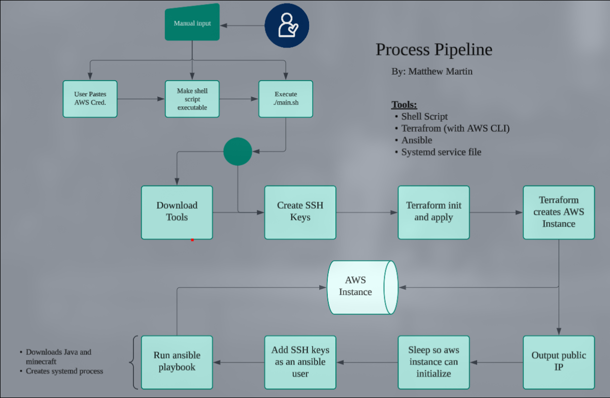

# Minecraft Server

*The following is just random things that need done to run the code properly so I don't forget later:*

    - *According to https://stackoverflow.com/questions/49743220/how-to-create-an-ssh-key-in-terraform I can create the ssh key pair, create the ubuntu instance, then use output to push private key variable (and public IP likely) to a .pem file (piping it with > prolly). Then deploy the ansible playbook onto the instance... 

***TO-DO:***
- Finished terraform, ansible.
- Need to clean up:
  - write docs **Partially Done**
  - Create git ignore and add the SSH keys and aws credential files for good practice, despite it not ever being pushed. 
- Create shutdown script.

# Deploy a Minecraft Server

## Backgound

The purpose of this repository is to create a minecraft server without needing to access the aws dashboard, the aws instance, or needing to use any CLI commands besides the setup. 

To do this, at a high level, I essentially uses shell script(s) to automate the entire process of:
- Using terraform to create the aws instance using the users aws credentials, 
- An ansible playbook will then be ran to access via SSH,
- Then do a series of tasks to download the necessary resources for the minecraft server,
- Followed by creating a systemd service file to keep the minecraft server running.


## Requirements

### User Configuration
No specific configuration is needed to run the pipeline, other than:
1. Pasting their AWS credentials in the cred file *(under `aws_creds/cred`)*
2. Make sure the shell scripts are executable with `chmod +x [file]`

Besides that, the user can decide to create their own SSH keypair if they desire, though they will need to:
- Name it `minecraft-key` 
- create it in the ssh_creds directory
- and comment out the creation of the key in the 'main.sh' script *(i.e. `ssh-keygen -t rsa -b 4096 -a 100 -N '' -f minecraft-key`)*.

Other than that, the script should configure all that is necessary.

### Tools 

The main tools used include:
- Terraform *(with AWS CLI)* and Ansible. 
This uses the latest versions of each, and the script includes an install using pacman for them. If you do not have any of these tools, I recommend installing them manually to your local device before running the script. 

### Credentials and CLI

There is two main credentials used in the automation process:
1. **AWS**

To actually create the aws instance, its necessary for terraform/awscli to have the user's AWS credentials. Simply paste the credentials in the `cred` file. It should look like the standard `~/.aws/credentials` file:
```
[default]
aws_access_key_id=<key id here>
aws_secret_access_key=<access key here>
aws_session_token=<token here>
```
2. **SSH**

The mains script will create the ssh key called `minecraft-key` during runtime for convenience, however you can also manually create your key as such:
```
cd ../ssh_creds
ssh-keygen -t rsa -b 4096 -a 100 -N '' -f minecraft-key
cd ..
```

The **Commands To Run** section will outline the specific commands to run to execute this script, though to summarize:
- `cd scripts`
- `chmod +x downloadtools.sh`
- `chmod +x main.sh`
- `./main.sh`

This is assuming the user already pasted their AWS credentials in the cred file under `aws-creds/cred` as mentioned above.

No extra configuration is needed beyond whats mentioned above, as the scripts should run the pipeline properly.

## Pipeline Diagram




## Steps to Run

1. Change to `scripts` directory:

```
cd scripts
```

2. Make `main.sh` and `downloadtools.sh` executable:

```
chmod +x main.sh
chmod +x downloadtools.sh
```

3. Paste AWS Credentials into `aws-creds/cred` file. Terraform 

```
[default]
aws_access_key_id=<key id here>
aws_secret_access_key=<access key here>
aws_session_token=<token here>
```

4. Run `main.sh`:

```
./main.sh
```

Now wait and watch as the script creates the instance and runs the server. It should take about one to two minutes.

## Connecting to the Server
  

## Sources Used:
- CoPilot for questions and general info
- https://stackoverflow.com/questions/49743220/how-to-create-an-ssh-key-in-terraform
- https://developer.hashicorp.com/terraform/tutorials/aws-get-started/aws-build
- https://developer.hashicorp.com/terraform/language
- https://dev.to/andreagrandi/getting-latest-ubuntu-ami-with-terraform-33gg
- https://cloudkatha.com/how-to-create-security-groups-in-aws-using-terraform/
- https://developer.hashicorp.com/terraform/cli/commands/apply#auto-approve (found from a stackoverflow post when googling)
- https://linuxbuz.com/devops/ansible-playbook-hosts-option
- https://docs.ansible.com/ansible/latest/collections/ansible/builtin/shell_module.html
- https://stackoverflow.com/questions/22844905/how-to-create-a-directory-using-ansible
- https://www.middlewareinventory.com/blog/ansible-copy-examples/
- https://www.digitalocean.com/community/tutorials/how-to-create-and-use-templates-in-ansible-playbooks
- https://docs.ansible.com/ansible/latest/collections/ansible/builtin/systemd_service_module.html#ansible-collections-ansible-builtin-systemd-service-module
- https://stackoverflow.com/questions/64124063/how-to-make-terraform-to-read-aws-credentials-file
- https://askubuntu.com/questions/694769/how-to-script-ssh-keygen-with-no-password
- 


